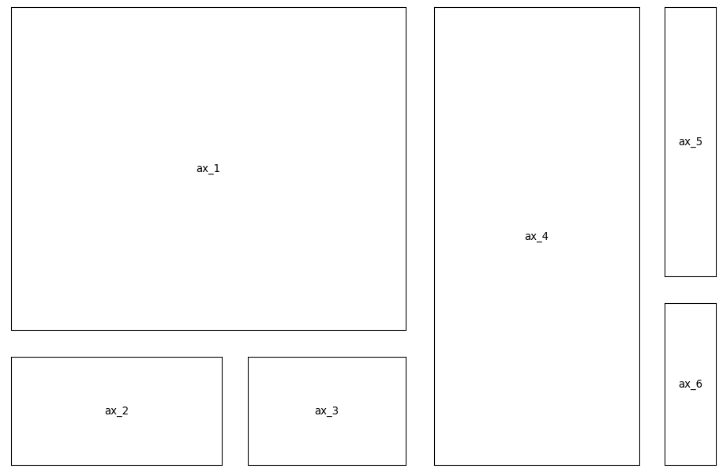

# Matplotlib Auto-layout

Matplotlib can be used to create plots with arbitrary layouts by using
[GridSpec][gs] and [GridSpecFromSubplotSpec][gss], but doing so is [fairly
cumbersome][ex].

The purpose of this library is to make the process as trivial as possible:


```python
from matplotlib_autolayout import generate_layout

# use ascii-art to specify the layout
# get the figure, a dictionary of axes,
# and the grid specifications
fig, axes, gridspecs = generate_layout('''
111111144445
111111144445
111111144445
111111144445
111111144445
111111144446
222233344446
222233344446
''')

# annotate the name of each axis in the center
for name, ax in axes.items():
    ax.annotate(f'{name}', (0.5, 0.5), ha='center', va='center')
    ax.set_xticks([])
    ax.set_yticks([])
```





In case you need to tweak the layout, you can generate the source code and
simply copy-paste it in your project:


```python
from matplotlib_autolayout import generate_source_code

generate_source_code('''
113
223
''')

```

This will print:

```
import matplotlib as mpl
import matplotlib.pyplot as plt
fig = plt.figure(figsize=(12, 8), dpi=96)

gridspecs = {}
axes = {}

gridspecs["gs_123"] = mpl.gridspec.GridSpec(
    figure=fig,
    nrows=1,
    ncols=2,
    height_ratios=[2],
    width_ratios=[2, 1],
    wspace=0.39999999999999997,
    hspace=0.25,
)

gridspecs["gs_12"] = mpl.gridspec.GridSpecFromSubplotSpec(
    subplot_spec=gridspecs["gs_123"][0],
    nrows=2,
    ncols=1,
    height_ratios=[1, 1],
    width_ratios=[2],
    wspace=0.3,
    hspace=0.5,
)
axes["ax_1"] = fig.add_subplot(gridspecs["gs_12"][0])
axes["ax_2"] = fig.add_subplot(gridspecs["gs_12"][1])

gridspecs["gs_3"] = mpl.gridspec.GridSpecFromSubplotSpec(
    subplot_spec=gridspecs["gs_123"][1],
    nrows=1,
    ncols=1,
    height_ratios=[2],
    width_ratios=[1],
    wspace=0.6,
    hspace=0.25,
)
axes["ax_3"] = fig.add_subplot(gridspecs["gs_3"][0])

for name, ax in axes.items():
    ax.annotate(f"ax {{name}}", (0.5, 0.5), ha="center", va="center")
```

This functionality is also implemented in a command-line utility by running the
module:

```
$ python -m matplotlib_autolayout --help
Usage: __main__.py [OPTIONS] [ART_FILE]

  Reads the layout ascii-art from a file (or stdin) and generates the
  necessary matplotlib code.

Options:
  -s, --show                  Preview the plot
  -ws, --wspace FLOAT         Horizontal separation between axes
  -hs, --hspace FLOAT         Vertical separation between axes
  -w, --width FLOAT           Figure width in inches
  -h, --height FLOAT          Figure height in inches
  -wf, --width-factor FLOAT   To determine the width, each character in the
                              ascii-artcorresponds to this many inches.
                              Overrides `width`.

  -wh, --height-factor FLOAT  To determine the height, each character in the
                              ascii-artcorresponds to this many inches.
                              Overrides `height`.

  -d, --dpi FLOAT             Dots-per-inch of the figure
  --help                      Show this message and exit.
```

## Requirements
There are no requirements for `generate_source_code`. The command line interface
needs [click][clk] and matplotlib, only if a preview is requested.
`generate_layout` needs matplotlib.


[gs]: https://matplotlib.org/3.1.3/api/_as_gen/matplotlib.gridspec.GridSpec.html
[gss]: https://matplotlib.org/3.1.3/api/_as_gen/matplotlib.gridspec.GridSpecFromSubplotSpec.html
[ex]: https://matplotlib.org/3.1.3/gallery/subplots_axes_and_figures/gridspec_nested.html#sphx-glr-gallery-subplots-axes-and-figures-gridspec-nested-py
[clk]: https://click.palletsprojects.com/en/7.x/
